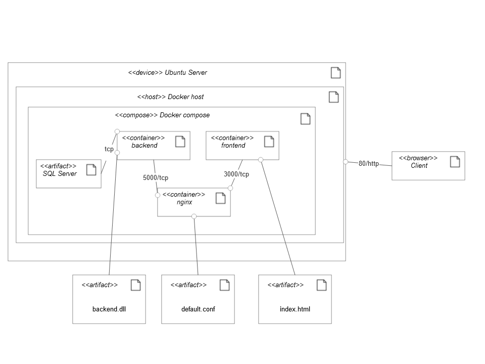

## Sistemos paskirtis
Automatizavimo programų pardavimo portalas. 

Sistema skirta palengvinti Automatizavimo programų pardavimus. Pardavėjas gali sukurti parduotuvę ir sukurti joje parduodamas programas. Vartotojas gali užsisakyti prenumeratą šios programos.

## Funkciniai reikalavimai
## Svečias gali:
    Prisiregistruti
        Kaip vartotojas
        Kaip pardavėjas
    Prisijungti
Pardavėjas gali:
    • Sukurti parduotuvę
    • Sukurti pardudamą programą
        o Programa gali būti ir nemokama
    • Matyti savo parduotuves
    • Matyti savo parduotuvės programas
    • Redaguoti programą
    • Redaguoti parduotuvę

Vartotojas gali:
    • Matyti visas parduotuves
    • Matyti parduotuvės parduodamas programas
    • Pasirinkti parduodamą program
        o Prenumeruoti programą
    • Matyti savo prenumeratas
        o Redaguoti prenumeratą
    ▪ Keisti terminą
    ▪ Atšaukti prenumeratą

Administratrius gali:
• Matyti visas programas
    o Ištrinti programą
• Matyti visas parduotuves
    o Ištrinti parduotuvę
    o Redaguoti parduotuvę

## Sistems architektūra

    Backend - .NET 7, EF Cre, SQL Server

    Frntend – React Vite Typescript
    
## Deplyment diagrama

