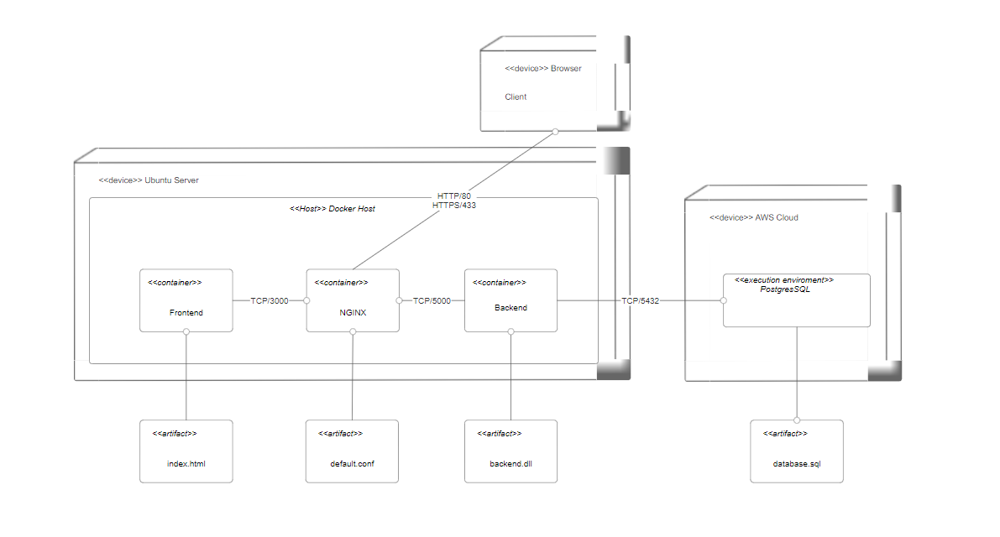

Sprendžiamo uždavinio aprašymas
## Sistemos paskirtis
Automatizavimo programų pardavimo portalas.
Sistema skirta palengvinti Automatizavimo programų pardavimus. Pardavėjas gali sukurti
parduotuvę ir sukurti joje parduodamas programas. Vartotojas gali užsisakyti prenumeratą šios
programos.
## Funkciniai reikalavimai
## Svečias gali:
    • Prisiregistruoti
        o Kaip vartotojas
        o Kaip pardavėjas
    • Prisijungti
## Pardavėjas gali:
    • Sukurti parduotuvę:
        o Įvesti pavadinimą
        o Įvesti aprašymą
        o Įvesti susisiekimo informaciją.
            • Matyti savo parduotuves
            • Sukurti parduodamą programą:
        o Įvesti programos informaciją.
            ▪ Pavadinimas
            ▪ Aprašymas
        o Įvesti internetinį puslapį kuriame parduodama programa veikia.
        o Įvesti 1 mėnesio prenumeratos kainą. (gali buti ir nemokama)
        o Parinkti prenumeratos laikotarpį
        o Įvesti programos instaliavimo instrukcijas.
## Vartotojas gali:
    o Matyti Parduotuves
        ▪ Matyti parduotuvės skelbimus
        ▪ Pasirinkti parduodamą programą
        • Matyti pardavimo informaciją
        • Matyti įvertinimą
        • Prenumeruoti programą
    o Matyti savo prenumeratas
        ▪ Įvertinti programą
        ▪ Atšaukti prenumeratą
## Administratorius gali:
    o Ištrinti įvertinimus
    o Ištrinti parduodamą program

## Sistems architektūra

    Backend - .NET 7, EF Cre, SQL Server

    Frntend – React Vite Typescript
    
## Deplyment diagrama

